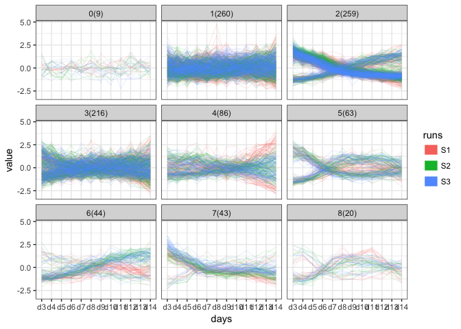
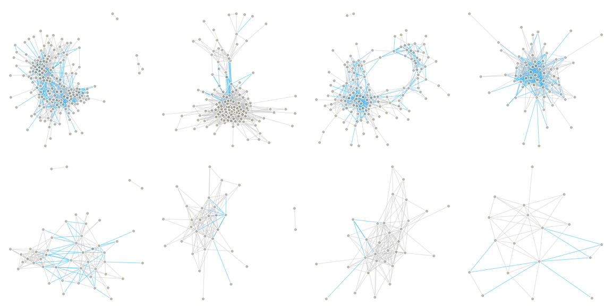
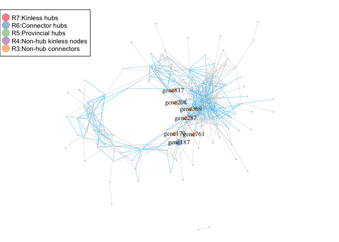
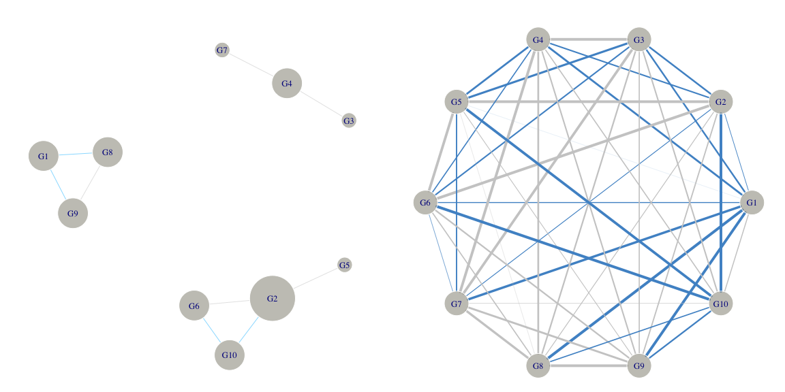
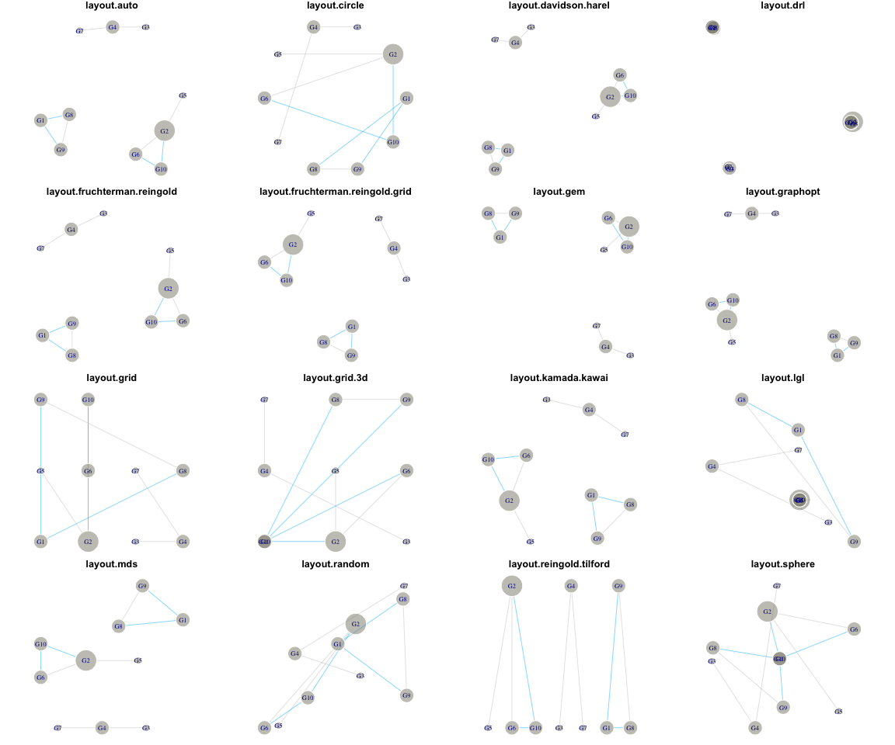
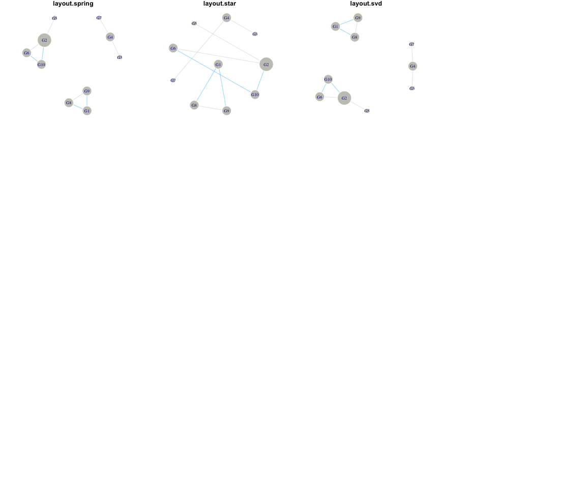

cornet
================

インストール
------------

``` r
install.packages("devtools") 
devtools::install_github("shkonishi/cornet")
```

関数及び外部データ一覧
----------------------

``` r
library(cornet)
ls("package:cornet")
```

    ## [1] "cl_dat"       "cluster_mat"  "cluster_mine" "corgraph"    
    ## [5] "dycutdf"      "gethub"       "igplot"       "matoedge"

### data

-   サンプルデータ(正規化済み, 行:遺伝子, 列:サンプル)

``` r
# data: normalized fpkm ----
nfpkm <- rskodat::nfpkm

# 1000 genes ----
nfpkm[1:6,1:6]; dim(nfpkm)
```

    ## # A tibble: 6 x 6
    ##        id   runs   days   reps    gene1    gene2
    ##    <fctr> <fctr> <fctr> <fctr>    <dbl>    <dbl>
    ## 1 S1_d3_1     S1     d3      1 35186.51 60569.57
    ## 2 S1_d3_1     S1     d3      1 36270.60 63175.20
    ## 3 S1_d3_1     S1     d3      1 42158.23 74559.29
    ## 4 S1_d4_2     S1     d4      2 56210.95 96871.40
    ## 5 S1_d4_2     S1     d4      2 47469.15 82112.15
    ## 6 S1_d4_2     S1     d4      2 51105.40 88918.34

    ## [1]  108 1004

### dycutdf

遺伝子のクラスタリングを行い、`dynamicTreeCut::cutreeDynamicTree`を用いてクラスタを検出する。クラスタごとのdataframe等を返す。 - `amap::Dist`のメソッドから距離定義を選択する。別手法で作成した距離行列を`as.dist`で変換したdistオブジェクトでも良い。
- `cutree`を使ってクラスターに分割する場合は`method_dycut`にkの値を入れる

``` r
res.cd <- dycutdf(dat = nfpkm[-1:-4], distm = "abscorrelation", clm = "average", method_dycut = "tree") 

# cutreeで分割する場合
# res.cd <- dycutdf(dat = dat, distm = "spearman", clm = "average",
#                            column = 5:ncol(dat), method_dycut = 2)
                           
# cutreeDynamicの結果
head(res.cd$dynamic_cut)
```

    ## gene1 gene2 gene3 gene4 gene5 gene6 
    ##     3     3     6     7     1     7

``` r
# クラスタ別のデータフレーム
sapply(res.cd$cluster_dat, dim)
```

    ##        0   1   2   3   4   5   6   7   8
    ## [1,] 108 108 108 108 108 108 108 108 108
    ## [2,]   9 260 259 216  86  63  44  43  20

### cluster\_mat

-   クラスター別にplot
-   因子のみのdata.frame

``` r
cluster_mat(nfpkm[-1:-4], res_dycut = res.cd$dynamic_cut, fcdat = nfpkm[2:3])
```



### corgraph

-   相関行列から自動的に閾値を指定してエッジリストを作成する
-   igraphオブジェクト, エッジリスト, ks-testの結果が返る
-   エッジリストには相関係数が属性値の列として加えられている(負の相関の情報はここから取る
-   逆相関のエッジも含めてグラフ作成する場合は、クラスタリングの時に`abspearson`とかを使う

``` r
# dycutdfの結果から特定のクラスタに属するデータを取り出す
cld <- res.cd$cluster_dat[["3"]]

# 相関係数行列
cormat <- cor(cld)

# グラフ作成
res.cg <- corgraph(mat = cormat)
```

    ## [1] "thresh:0.63  p:0"

``` r
# 返り値1. igraphオブジェクト
(g <- res.cg$undir.graph)
```

    ## IGRAPH a12f461 UN-- 216 639 -- 
    ## + attr: name (v/c), e.c (e/c)
    ## + edges from a12f461 (vertex names):
    ##  [1] gene1--gene2   gene1--gene33  gene1--gene36  gene1--gene42 
    ##  [5] gene1--gene47  gene1--gene77  gene1--gene80  gene1--gene95 
    ##  [9] gene1--gene120 gene1--gene138 gene1--gene207 gene1--gene230
    ## [13] gene1--gene236 gene1--gene296 gene1--gene336 gene1--gene415
    ## [17] gene1--gene518 gene1--gene523 gene1--gene564 gene1--gene601
    ## [21] gene1--gene650 gene1--gene711 gene1--gene808 gene1--gene854
    ## [25] gene1--gene950 gene2--gene33  gene2--gene36  gene2--gene42 
    ## [29] gene2--gene47  gene2--gene77  gene2--gene80  gene2--gene120
    ## + ... omitted several edges

``` r
# 返り値2. エッジリスト
head(res.cg$edge.list)
```

    ##     x_id   y_id      value
    ## 1  gene1  gene2  0.9685828
    ## 8  gene1 gene33  0.7189499
    ## 9  gene1 gene36  0.6362989
    ## 10 gene1 gene42 -0.6807494
    ## 11 gene1 gene47  0.7782583
    ## 18 gene1 gene77 -0.6665180

``` r
# 返り値3. ks-testの結果
head(res.cg$res.ks.text)
```

    ##   thresh      ks_d ks_p
    ## 1   0.30 0.6638981    0
    ## 2   0.31 0.6494917    0
    ## 3   0.32 0.6397816    0
    ## 4   0.33 0.6256739    0
    ## 5   0.34 0.6243533    0
    ## 6   0.35 0.6440408    0

``` r
# 全クラスターについてgraphオブジェクトのみ作成
clds <- res.cd$cluster_dat
cl_gs <- lapply(clds, function(x)corgraph(cor(x))[[1]])
```

    ## [1] "thresh:0.3  p:0.000246819608172966"
    ## [1] "thresh:0.5  p:0"
    ## [1] "thresh:0.93  p:0"
    ## [1] "thresh:0.63  p:0"
    ## [1] "thresh:0.7  p:8.76947625627622e-10"
    ## [1] "thresh:0.84  p:0.000487776622894787"
    ## [1] "thresh:0.82  p:0.00026819873700934"
    ## [1] "thresh:0.83  p:8.09146157136897e-05"
    ## [1] "thresh:0.77  p:0.618818215797673"

``` r
# 特定の遺伝子がどのクラスタにいるのかを調べる
sapply(clds, function(x)match("gene1",names(x)))
```

    ##  0  1  2  3  4  5  6  7  8 
    ## NA NA NA  1 NA NA NA NA NA

### igplot

igraphオブジェクトをプロットする。たくさんあるパラメータの表記をできるだけ省略したいので、よく使うオプションは初期値を指定してある。大雑把に視覚化したい時に使う。

``` r
cl_gs <- cl_gs[-1]
par(mfrow=c(2,4))
for (i in seq_along(cl_gs)){
  igplot(cl_gs[[i]], v.l = NA)
}
```



### gethub

-   ノードごとに中心性解析の結果を調べる
-   中心性解析の結果(data.frame)と連結成分のみのigraphオブジェクトが返る。

``` r
res.hub <- gethub(g = cl_gs[["3"]], com_fun = "cluster_louvain")
```



``` r
head(res.hub[[2]])
```

    ##            node module_member num_of_members   between degree    ndegree
    ## gene287 gene287            82             32 1684.1356     24 0.11111111
    ## gene92   gene92            78             21 1281.4082     18 0.08333333
    ## gene737 gene737            53             17 1082.1578     13 0.06018519
    ## gene585 gene585            51             31  920.0044     11 0.05092593
    ## gene564 gene564            56             35  817.0351     39 0.18055556
    ## gene851 gene851            51             31  792.9401     14 0.06481481
    ##         within_module_degree participation_coefficient
    ## gene287            0.9746856                 0.6597222
    ## gene92             2.0575490                 0.2901235
    ## gene737            1.2007507                 0.5207101
    ## gene585            0.5928863                 0.2975207
    ## gene564            2.0648955                 0.5641026
    ## gene851            0.5928863                 0.4591837
    ##                           role
    ## gene287 R3: Non-hub connectors
    ## gene92    R2: Peripheral nodes
    ## gene737   R2: Peripheral nodes
    ## gene585   R2: Peripheral nodes
    ## gene564   R2: Peripheral nodes
    ## gene851   R2: Peripheral nodes

#### グラフ作成と描画

-   `corgraph`を使って閾値を元にグラフ作成する場合と`matoedge`を使って完全グラフを作る場合

``` r
# サンプルデータ
dat <- data.frame(
 S1 = c(43.26, 166.6, 12.53, 28.77, 114.7, 119.1, 118.9, 3.76, 32.73, 17.46),
 S2 = c(40.89, 41.87, 39.55, 191.92, 79.7, 80.57, 156.69, 2.48, 11.99, 56.11),
 S3 = c(5.05, 136.65, 42.09, 236.56, 99.76, 114.59, 186.95, 136.78, 118.8, 21.41)
 )
rownames(dat) <- paste0("G", 1:10)

# グラフ作成
cormat <- round(cor(t(dat)),2)
g1 <- corgraph(cormat)[[1]]
```

    ## [1] "thresh:0.95  p:0.916883357943937"

``` r
g2 <- cornet::matoedge(cormat)

# 閾値グラフ
par(mfrow=c(1,2))
igplot(g1, v.s = igraph::degree(g1)*10)

# 完全グラフ
ewid <- abs(igraph::E(g2)$weight)
ecol <-  ifelse(igraph::E(g2)$weight < 0 , "steelblue3", "grey80")
igplot(ig = g2, lay=igraph::layout.circle, v.s = 15, e.c = ecol, e.w = ewid*4)
```



#### 色々なレイアウト関数を試す

-   igraphのlayoutの関数を取得して全てplot
-   データの種類とlayout関数の組み合わせによってはerrorになる

``` r
par(mfrow = c(4,4))　
cornet::igplot(ig = g1, lay = "all", v.s = igraph::degree(g1)*10)  
```

    ## [1] "Error in layout layout.bipartite"

    ## [1] "Error in layout layout.merge"
    ## [1] "Error in layout layout.norm"



    ## [1] "Error in layout layout.sugiyama"



### matoedge

-   相関行列のような対称行列から重み付きエッジリスト(完全グラフ)を作成

``` r
# 相関行列のような対称行列から重み付きエッジリストを作成
cormat <- cor(res.cd$cluster_dat$`1`)
edge.list <- matoedge(mat = cormat, format = "df", diag = F, zero.weight = F)
head(edge.list)
```

    ##    x_id   y_id      value
    ## 1 gene5 gene10  0.1233587
    ## 2 gene5 gene18  0.2805830
    ## 3 gene5 gene19 -0.1298475
    ## 4 gene5 gene21  0.2570630
    ## 5 gene5 gene24  0.1384865
    ## 6 gene5 gene30 -0.2834247

### cluster\_mine

非線形の関連を見つける。`minerva::mine`を実行して、その結果を整形してdataframeで返す - pearson(r)とspearman(rho)も計算する - TICの大きい順に並べる

``` r
# mineを連続実行、結果を整形出力
cldat <- as.data.frame(res.cd$cluster_dat[["3"]])
res.mic <- cluster_mine(cl_dat = cldat)

# 結果を一部表示
res.mic[1:3,]
```

    ##          x_id    y_id       mic        mas       mev      mcn       micr2
    ## 1       gene1   gene2 1.0000000 0.03697997 1.0000000 4.000000 0.061847314
    ## 18780 gene564 gene650 0.9018446 0.11191302 0.9018446 3.321928 0.292489042
    ## 110     gene1 gene518 0.8328518 0.07866313 0.8328518 2.584963 0.005843989
    ##            gmic      tic    pearson   spearman
    ## 1     0.9427421 16.23850  0.9685828  0.9553765
    ## 18780 0.8307941 13.44838 -0.7806123 -0.8690255
    ## 110   0.7600601 13.38530  0.9093997  0.9170787
