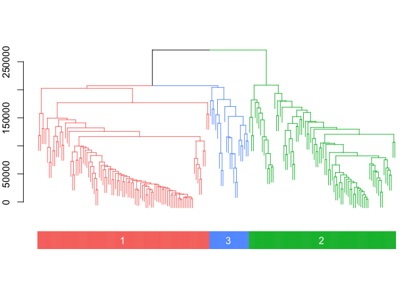
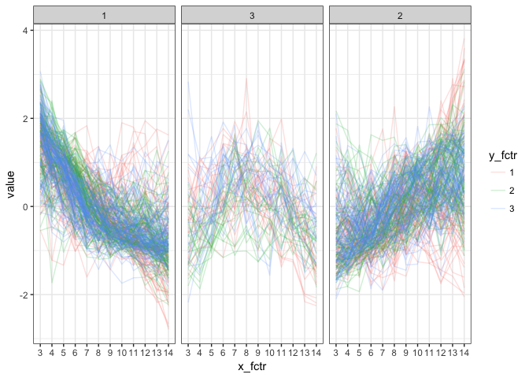
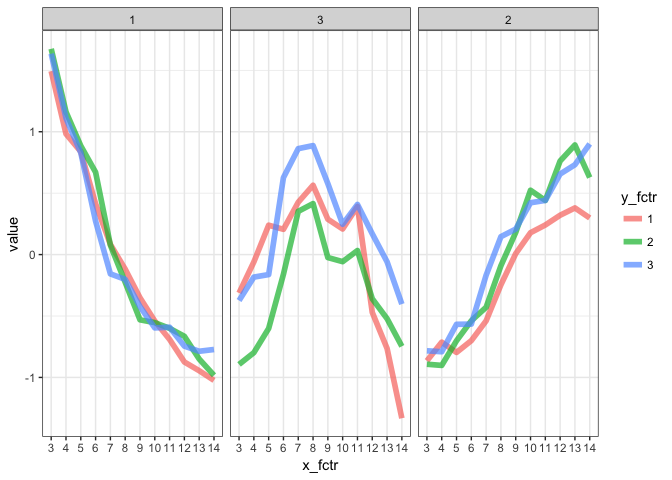

cornet
================

インストール
------------

``` r
#install.packages("devtools") # もしなければ
devtools::install_github("shkonishi/cornet")
```

    ## Skipping install of 'cornet' from a github remote, the SHA1 (d5b818e7) has not changed since last install.
    ##   Use `force = TRUE` to force installation

関数及び外部データ一覧
----------------------

``` r
library(cornet)
ls("package:cornet")
```

    ## [1] "cluster_dat"  "cluster_mat"  "cluster_mine" "corheat"     
    ## [5] "matoedge"

### data

``` r
# data: normalized fpkm
fp <- system.file("extdata/nfpkm_200.txt", package = "cornet")
dat <- read.table(fp, header=TRUE, stringsAsFactors = FALSE)

# 200 genes
dat[1:6,1:6]; dim(dat)
```

    ##   id runs days reps  gene266  gene372
    ## 1  1    1    3    1 17.18686 4.130407
    ## 2  2    1    3    1 19.13915 4.413801
    ## 3  3    1    3    1 19.14471 3.961325
    ## 4  4    1    4    2 15.22853 4.668531
    ## 5  5    1    4    2 18.55824 6.054861
    ## 6  6    1    4    2 18.79719 7.802054

    ## [1] 108 204

### corheat

-   `abspearson`, `squarepearson`, `pearson`, `spearman`から

``` r
# corheat with dynamic tree cut
res <- cornet::corheat(dat=dat[-1:-4], distm="spearman", clm="average", 
                method_dycut="tree", draw=TRUE)
```


``` r
names(res)
```

    ## [1] "cormat"             "r_hcl"              "cl_with_dynamiccut"

``` r
# cornet::corheat(dat=dat[-1:-4], distm="abspearson", clm="average", 
#                 method_dycut="tree", draw=TRUE)
# cornet::corheat(dat=dat[-1:-4], distm="squarepearson", clm="average", 
#                 method_dycut="tree", draw=TRUE)
```

### cluster\_mat

-   `amap::Dist`のメソッドから距離定義を選択
-   別手法で作成した距離行列を`as.dist`で変換したdistオブジェクトでも良い

``` r
res <- cornet::cluster_mat(dat = dat, distm = "spearman", clm = "average",
                           column = 5:ncol(dat), method_dycut = "hybrid",
                           x_fctr = dat$days, y_fctr = dat$runs, rep_fctr = dat$reps)
```

    ##  ..cutHeight not given, setting it to 268000  ===>  99% of the (truncated) height range in dendro.
    ##  ..done.



``` r
# cutreeDynamicの結果
head(res$dynamic_cut)
```

    ## gene266 gene372 gene572 gene906 gene201 gene894 
    ##       1       2       2       2       1       1

``` r
# クラスタ別のデータフレーム
sapply(res$cluster_dat, dim)
```

    ##        1   2   3
    ## [1,] 108 108 108
    ## [2,]  96  82  22

``` r
# クラスタ別の
res$gg_mat_all
```



``` r
res$gg_mat_med
```



### cluster\_mine

-   `minerva::mine`の出力を整形, pearsonとspearmanも加える

``` r
# mineを連続実行、結果を整形出力
res.clm <- cluster_mine(cl_dat = res$cluster_dat)
```

    ## Warning: executing %dopar% sequentially: no parallel backend registered

``` r
# 
lapply(res.clm, function(x)x[1:6,1:6])
```

    ## $`1`
    ##         x_id    y_id mic        mas mev      mcn
    ## 4425 gene204 gene655   1 0.03285807   1 2.000000
    ## 4485  gene67 gene519   1 0.01908699   1 3.000000
    ## 4460 gene179 gene519   1 0.04402342   1 3.000000
    ## 4470 gene789  gene67   1 0.04047976   1 3.584963
    ## 4457 gene179  gene67   1 0.01189086   1 3.000000
    ## 4484  gene67 gene371   1 0.09622638   1 3.000000
    ## 
    ## $`2`
    ##         x_id    y_id       mic        mas       mev      mcn
    ## 3170 gene850 gene558 0.9744918 0.02346228 0.9744918 3.807355
    ## 3186 gene491 gene558 1.0000000 0.01791730 1.0000000 4.000000
    ## 3169 gene850 gene491 0.9744918 0.06201446 0.9744918 3.321928
    ## 2871 gene507 gene558 1.0000000 0.09008929 1.0000000 3.000000
    ## 2999 gene572 gene900 1.0000000 0.03026810 1.0000000 3.584963
    ## 3135 gene651 gene558 1.0000000 0.03673405 1.0000000 4.000000
    ## 
    ## $`3`
    ##        x_id    y_id       mic        mas       mev      mcn
    ## 204 gene380 gene132 0.7558046 0.13125066 0.7558046 2.584963
    ## 112 gene530 gene498 0.6459352 0.11888400 0.6459352 2.000000
    ## 197 gene398 gene132 0.7145259 0.22761319 0.7145259 2.584963
    ## 189 gene917 gene132 0.5175286 0.07059585 0.5175286 2.000000
    ## 188 gene917 gene380 0.4971026 0.09883919 0.4971026 2.000000
    ## 180 gene805 gene132 0.5859004 0.15385737 0.5859004 2.584963

### matoedge

``` r
# 相関行列のような対称行列から重み付きエッジリストを作成
edge.list <- matoedge(cor(res$cluster_dat[[1]]))
head(edge.list)
```

    ##      x_id    y_id       value
    ## 1 gene478 gene315 0.371799358
    ## 2 gene478 gene438 0.216129367
    ## 3 gene478 gene324 0.419083487
    ## 4 gene478 gene707 0.077285184
    ## 5 gene478  gene23 0.009250348
    ## 6 gene478 gene200 0.200931931
