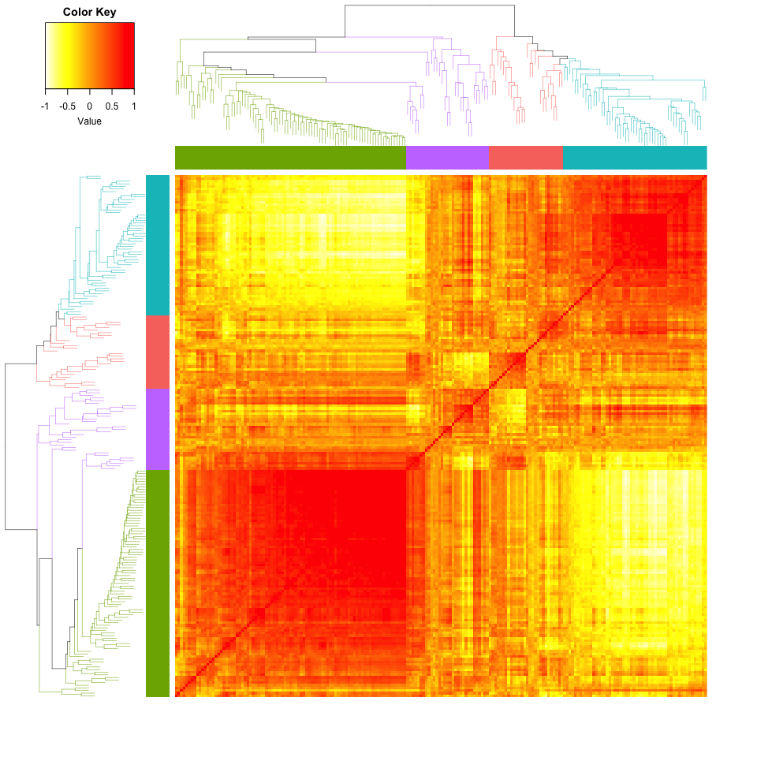

cornet
================

インストール
------------

``` r
#install.packages("devtools") # もしなければ
devtools::install_github("shkonishi/cornet")
```

    ## Downloading GitHub repo shkonishi/cornet@master
    ## from URL https://api.github.com/repos/shkonishi/cornet/zipball/master

    ## Installing cornet

    ## '/Library/Frameworks/R.framework/Resources/bin/R' --no-site-file  \
    ##   --no-environ --no-save --no-restore --quiet CMD INSTALL  \
    ##   '/private/var/folders/gv/z4zrp5_56s1_dg83x645g5lr0000gn/T/Rtmplx7MYD/devtoolsb5b824d65798/shkonishi-cornet-1402cc4'  \
    ##   --library='/Library/Frameworks/R.framework/Versions/3.4/Resources/library'  \
    ##   --install-tests

    ## 

関数及び外部データ一覧
----------------------

``` r
library(cornet)
ls("package:cornet")
```

    ## [1] "cluster_dat"  "cluster_mat"  "cluster_mine" "corheat"     
    ## [5] "matoedge"

### corheat

``` r
# data: normalized fpkm
fp <- system.file("extdata/nfpkm_rnsq.txt", package = "rsko")
nfpkm <- read.table(fp, header=TRUE, stringsAsFactors = FALSE)

# sampling 200 genes
set.seed(1)
dat <- nfpkm[,sample(5:ncol(nfpkm), 200)]

# corheat with dynamic tree cut
res <- cornet::corheat(dat=dat, distm="spearman", clm="average", 
                       method_dycut="tree", draw=TRUE)
```


