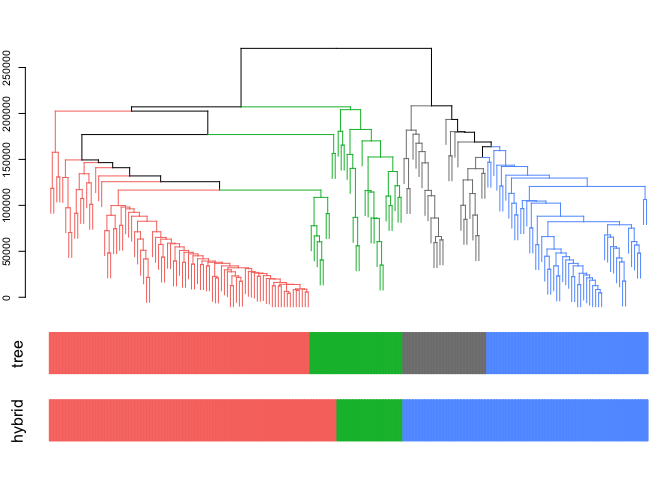

cornet
================

インストール
------------

``` r
install.packages("devtools") 
devtools::install_github("shkonishi/cornet")
```

関数及び外部データ一覧
----------------------

``` r
library(cornet)
ls("package:cornet")
```

    ## [1] "cluster_dat"  "cluster_mat"  "cluster_mine" "corgraph"    
    ## [5] "corheat"      "matoedge"

### data

-   正規化した遺伝子発現データ(行:遺伝子, 列:サンプル)

``` r
# data: normalized fpkm
fp <- system.file("extdata/nfpkm_200.txt", package = "cornet")
dat <- read.table(fp, header=TRUE, stringsAsFactors = FALSE)

# 200 genes
dat[1:6,1:6]; dim(dat)
```

    ##   id runs days reps  gene266  gene372
    ## 1  1    1    3    1 17.18686 4.130407
    ## 2  2    1    3    1 19.13915 4.413801
    ## 3  3    1    3    1 19.14471 3.961325
    ## 4  4    1    4    2 15.22853 4.668531
    ## 5  5    1    4    2 18.55824 6.054861
    ## 6  6    1    4    2 18.79719 7.802054

    ## [1] 108 204

### cluster\_mat

遺伝子のクラスタリングを行い、`dynamicTreeCut::cutreeDynamicTree`を用いてクラスタを検出する。クラスタごとのdataframe等を返す。 - `amap::Dist`のメソッドから距離定義を選択する。別手法で作成した距離行列を`as.dist`で変換したdistオブジェクトでも良い。

``` r
res.clm <- cluster_mat(dat = dat, distm = "spearman", clm = "average",
                           column = 5:ncol(dat), method_dycut = "tree",
                           x_fctr = dat$days, y_fctr = dat$runs, rep_fctr = dat$reps)
```



``` r
# cutreeDynamicの結果
head(res.clm$dynamic_cut)
```

    ## gene266 gene372 gene572 gene906 gene201 gene894 
    ##       3       2       2       2       1       1

``` r
# クラスタ別のデータフレーム
sapply(res.clm$cluster_dat, dim)
```

    ##        0   1   3   2
    ## [1,] 108 108 108 108
    ## [2,]  28  87  31  54

``` r
# クラスタ別のplot
res.clm$gg_mat_all
```


``` r
res.clm$gg_mat_med
```


### matoedge

-   相関行列のような対称行列から重み付きエッジリスト(完全グラフ)を作成

``` r
# 相関行列のような対称行列から重み付きエッジリストを作成
edge.list <- matoedge(cor(res.clm$cluster_dat[[1]]), diag = F, zero.weight = F)
head(edge.list)
```

    ##     x_id    y_id        value
    ## 1 gene54 gene442  0.364463358
    ## 2 gene54 gene222  0.262606491
    ## 3 gene54 gene568 -0.005069097
    ## 4 gene54 gene925  0.105762776
    ## 5 gene54 gene454  0.086375472
    ## 6 gene54 gene694  0.164309172

#### corgraph

-   相関行列から自動的に閾値を指定してエッジリストを作成する
-   igraphオブジェクト, エッジリスト, ks-testの結果が返る
-   エッジリストには相関係数が属性値の列として加えられている(負の相関の情報はここから取る
-   逆相関のエッジも含めてグラフ作成する場合は、クラスタリングの時に`abspearson`とかを使う

``` r
# サンプルデータ
data(cluster_dat)

# 相関係数行列
cormat <- cor(cluster_dat[[1]])

# グラフ作成
res <- corgraph(mat = cormat)

# 返り値1. igraphオブジェクト
(g <- res$undir.graph)
```

    ## IGRAPH 08265fe UN-- 120 1605 -- 
    ## + attr: name (v/c)
    ## + edges from 08265fe (vertex names):
    ##  [1] gene158--gene838 gene765--gene118 gene765--gene871 gene765--gene189
    ##  [5] gene765--gene818 gene838--gene118 gene686--gene770 gene910--gene271
    ##  [9] gene910--gene416 gene910--gene278 gene910--gene254 gene271--gene510
    ## [13] gene416--gene510 gene510--gene281 gene271--gene416 gene271--gene278
    ## [17] gene271--gene964 gene271--gene281 gene271--gene971 gene416--gene278
    ## [21] gene416--gene281 gene563--gene270 gene563--gene246 gene563--gene920
    ## [25] gene278--gene563 gene563--gene67  gene563--gene371 gene190--gene220
    ## [29] gene270--gene190 gene220--gene709 gene220--gene977 gene270--gene220
    ## + ... omitted several edges

``` r
# 返り値2. エッジリスト
head(res$edge.list)
```

    ##         x_id    y_id     value
    ## 2567 gene158 gene838 0.9323359
    ## 3017 gene765 gene118 0.9422020
    ## 3187 gene765 gene871 0.9342737
    ## 3188 gene765 gene189 0.9582303
    ## 3189 gene765 gene818 0.9388109
    ## 3242 gene118 gene838 0.9547732

``` r
# 返り値3. ks-testの結果
head(res$res.ks.text)
```

    ##   thresh      ks_d ks_p
    ## 1   0.30 0.8985904    0
    ## 2   0.31 0.8974663    0
    ## 3   0.32 0.8897840    0
    ## 4   0.33 0.8951993    0
    ## 5   0.34 0.8865022    0
    ## 6   0.35 0.8853600    0

### cluster\_mine

非線形の関連を見つける。`minerva::mine`を実行して、その結果を整形してdataframeで返す - pearson(r)とspearman(rho)も計算する - TICの大きい順に並べる

``` r
# mineを連続実行、結果を整形出力
cldat <- res.clm$cluster_dat$`2`
res.mic <- cluster_mine(cl_dat = cldat)

# 結果を一部表示
res.mic[1:3,]
```

    ##         x_id    y_id       mic        mas       mev      mcn       micr2
    ## 1280 gene850 gene558 0.9744918 0.02346228 0.9744918 3.807355 0.008202131
    ## 1296 gene491 gene558 1.0000000 0.01791730 1.0000000 4.000000 0.059638626
    ## 1279 gene850 gene491 0.9744918 0.06201446 0.9744918 3.321928 0.052296549
    ##           gmic      tic   pearson  spearman
    ## 1280 0.9343362 17.28197 0.9830003 0.9613498
    ## 1296 0.9452102 16.93374 0.9697223 0.9770309
    ## 1279 0.9407437 16.76802 0.9603100 0.9584441
