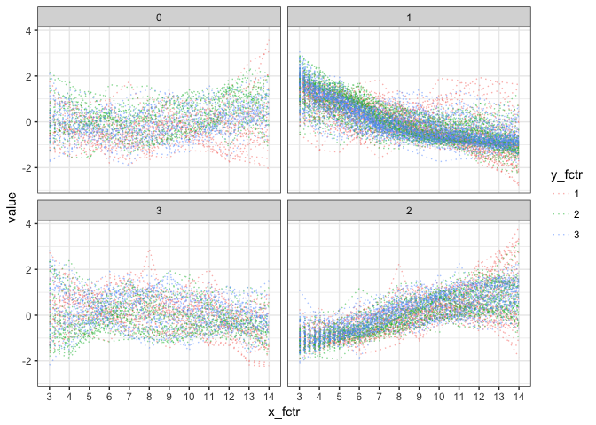

cornet
================

インストール
------------

``` r
install.packages("devtools") 
devtools::install_github("shkonishi/cornet")
```

関数及び外部データ一覧
----------------------

``` r
library(cornet)
ls("package:cornet")
```

    ## [1] "cluster_dat"  "cluster_mat"  "cluster_mine" "corheat"     
    ## [5] "matoedge"

### data

``` r
# data: normalized fpkm
fp <- system.file("extdata/nfpkm_200.txt", package = "cornet")
dat <- read.table(fp, header=TRUE, stringsAsFactors = FALSE)

# 200 genes
dat[1:6,1:6]; dim(dat)
```

    ##   id runs days reps  gene266  gene372
    ## 1  1    1    3    1 17.18686 4.130407
    ## 2  2    1    3    1 19.13915 4.413801
    ## 3  3    1    3    1 19.14471 3.961325
    ## 4  4    1    4    2 15.22853 4.668531
    ## 5  5    1    4    2 18.55824 6.054861
    ## 6  6    1    4    2 18.79719 7.802054

    ## [1] 108 204

### cluster\_mat

-   `amap::Dist`のメソッドから距離定義を選択
-   別手法で作成した距離行列を`as.dist`で変換したdistオブジェクトでも良い

``` r
res <- cornet::cluster_mat(dat = dat, distm = "spearman", clm = "average",
                           column = 5:ncol(dat), method_dycut = "tree",
                           x_fctr = dat$days, y_fctr = dat$runs, rep_fctr = dat$reps)
```


``` r
# cutreeDynamicの結果
head(res$dynamic_cut)
```

    ## gene266 gene372 gene572 gene906 gene201 gene894 
    ##       3       2       2       2       1       1

``` r
# クラスタ別のデータフレーム
sapply(res$cluster_dat, dim)
```

    ##        1   3   0   2
    ## [1,] 108 108 108 108
    ## [2,]  87  31  28  54

``` r
# クラスタ別の
res$gg_mat_all
```



``` r
res$gg_mat_med
```


### cluster\_mine

-   `minerva::mine`の出力を整形, pearsonとspearmanも加える

``` r
# mineを連続実行、結果を整形出力
res.clm <- cluster_mine(cl_dat = res$cluster_dat)

# 
lapply(res.clm, function(x)x[1:6,])
```

    ## $`1`
    ##         x_id    y_id mic        mas mev      mcn      micr2      gmic
    ## 3714 gene204 gene655   1 0.03285807   1 2.000000 0.05284526 1.0000000
    ## 3738  gene67 gene519   1 0.01908699   1 3.000000 0.05036932 0.9935214
    ## 3731 gene179 gene519   1 0.04402342   1 3.000000 0.06798504 0.9942813
    ## 3732 gene789  gene67   1 0.04047976   1 3.584963 0.05791981 0.9806749
    ## 3728 gene179  gene67   1 0.01189086   1 3.000000 0.09046485 0.9930227
    ## 3737  gene67 gene371   1 0.09622638   1 3.000000 0.02788684 0.9865954
    ##           tic   pearson  spearman
    ## 3714 18.12556 0.9732188 0.9794221
    ## 3738 17.94552 0.9744900 0.9627502
    ## 3731 17.61939 0.9654092 0.9593205
    ## 3732 17.51823 0.9706082 0.9639506
    ## 3728 17.49004 0.9536955 0.9626930
    ## 3737 17.36597 0.9859580 0.9648080
    ## 
    ## $`3`
    ##        x_id    y_id       mic        mas       mev      mcn      micr2
    ## 133 gene698 gene380 0.7878513 0.08065127 0.7878513 2.584963 0.14646347
    ## 438 gene380 gene132 0.7558046 0.13125066 0.7558046 2.584963 0.06480325
    ## 134 gene698 gene132 0.7189312 0.06435604 0.7189312 2.584963 0.05946409
    ## 31  gene826  gene62 0.7056530 0.04210850 0.7056530 2.584963 0.06088894
    ## 80   gene62 gene380 0.6711388 0.05596903 0.6711388 2.584963 0.07683509
    ## 88  gene266 gene698 0.7124452 0.16418719 0.7124452 2.584963 0.05858157
    ##          gmic       tic    pearson   spearman
    ## 133 0.7074252 11.867889 -0.8008670 -0.8240114
    ## 438 0.6789852 11.021268  0.8312649  0.8333095
    ## 134 0.6274129 10.673320 -0.8120758 -0.7986891
    ## 31  0.6211462 10.319357  0.8029720  0.6412873
    ## 80  0.5832082  9.912205 -0.7709110 -0.7772633
    ## 88  0.6230904  9.821684  0.8086183  0.8068250
    ## 
    ## $`0`
    ##        x_id    y_id       mic        mas       mev      mcn      micr2
    ## 259 gene331 gene485 0.6061471 0.02817255 0.6061471 2.000000 0.18818752
    ## 227 gene754 gene331 0.5795805 0.03755272 0.5795805 2.000000 0.17060362
    ## 226 gene754 gene944 0.5517252 0.05668312 0.5517252 2.000000 0.04258118
    ## 373 gene958 gene241 0.5642428 0.08287044 0.5642428 2.000000 0.11962117
    ## 244 gene944 gene485 0.5685831 0.07183381 0.5685831 2.584963 0.10390175
    ## 228 gene754 gene485 0.5377324 0.14018524 0.5377324 2.000000 0.03607627
    ##          gmic      tic   pearson  spearman
    ## 259 0.5296532 8.852612 0.6464979 0.7024589
    ## 227 0.5013204 8.207523 0.6395130 0.7129288
    ## 226 0.4767254 8.033038 0.7135433 0.7166157
    ## 373 0.4690225 7.565197 0.6667995 0.6806330
    ## 244 0.4354489 7.338720 0.6816754 0.6876542
    ## 228 0.4733235 7.324082 0.7082768 0.6938847
    ## 
    ## $`2`
    ##         x_id    y_id       mic        mas       mev      mcn       micr2
    ## 1280 gene850 gene558 0.9744918 0.02346228 0.9744918 3.807355 0.008202131
    ## 1296 gene491 gene558 1.0000000 0.01791730 1.0000000 4.000000 0.059638626
    ## 1279 gene850 gene491 0.9744918 0.06201446 0.9744918 3.321928 0.052296549
    ## 981  gene507 gene558 1.0000000 0.09008929 1.0000000 3.000000 0.250265011
    ## 1109 gene572 gene900 1.0000000 0.03026810 1.0000000 3.584963 0.141137013
    ## 1245 gene651 gene558 1.0000000 0.03673405 1.0000000 4.000000 0.123150137
    ##           gmic      tic   pearson  spearman
    ## 1280 0.9343362 17.28197 0.9830003 0.9613498
    ## 1296 0.9452102 16.93374 0.9697223 0.9770309
    ## 1279 0.9407437 16.76802 0.9603100 0.9584441
    ## 981  0.9935214 16.48217 0.8658724 0.8620424
    ## 1109 0.9611421 16.45482 0.9267486 0.8917850
    ## 1245 0.9404114 16.26148 0.9364026 0.9300066

### matoedge

``` r
# 相関行列のような対称行列から重み付きエッジリストを作成
edge.list <- matoedge(cor(res$cluster_dat[[1]]))
head(edge.list)
```

    ##      x_id    y_id       value
    ## 1 gene478 gene315 0.371799358
    ## 2 gene478 gene438 0.216129367
    ## 3 gene478 gene324 0.419083487
    ## 4 gene478 gene707 0.077285184
    ## 5 gene478  gene23 0.009250348
    ## 6 gene478 gene200 0.200931931
